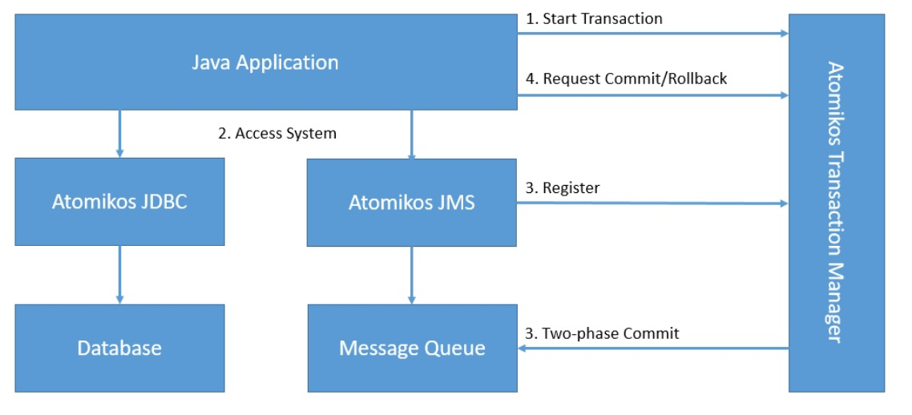

# Распределённые транзакции

https://habr.com/ru/articles/580090/
https://docs.spring.io/spring-boot/docs/2.0.x/reference/html/boot-features-jta.html
https://www.baeldung.com/java-atomikos - вариант распределённой транзакции в контексте Atomikos

## про двухфазную фиксацию
https://www.techtarget.com/searchapparchitecture/definition/two-phase-commit-2PC
https://martinfowler.com/articles/patterns-of-distributed-systems/two-phase-commit.html
https://en.wikipedia.org/wiki/Two-phase_commit_protocol
https://otus.ru/nest/post/2945/ (тут слабовато чот)
https://www.narayana.io/ технология реализации
или https://www.atomikos.com/Main/WebHome
(про него во https://www.baeldung.com/java-atomikos, а в контексте REST про него во https://www.atomikos.com/Blog/TransactionalRESTMicroservicesWithAtomikos)
или https://github.com/bitronix/btm
реализуют JTA
### Схема работы атомикоса

Про сам JTA:
https://www.progress.com/tutorials/jdbc/understanding-jta
## про саги
https://learn.microsoft.com/ru-ru/azure/architecture/reference-architectures/saga/saga
## про XA
https://ru.wikipedia.org/wiki/XA

